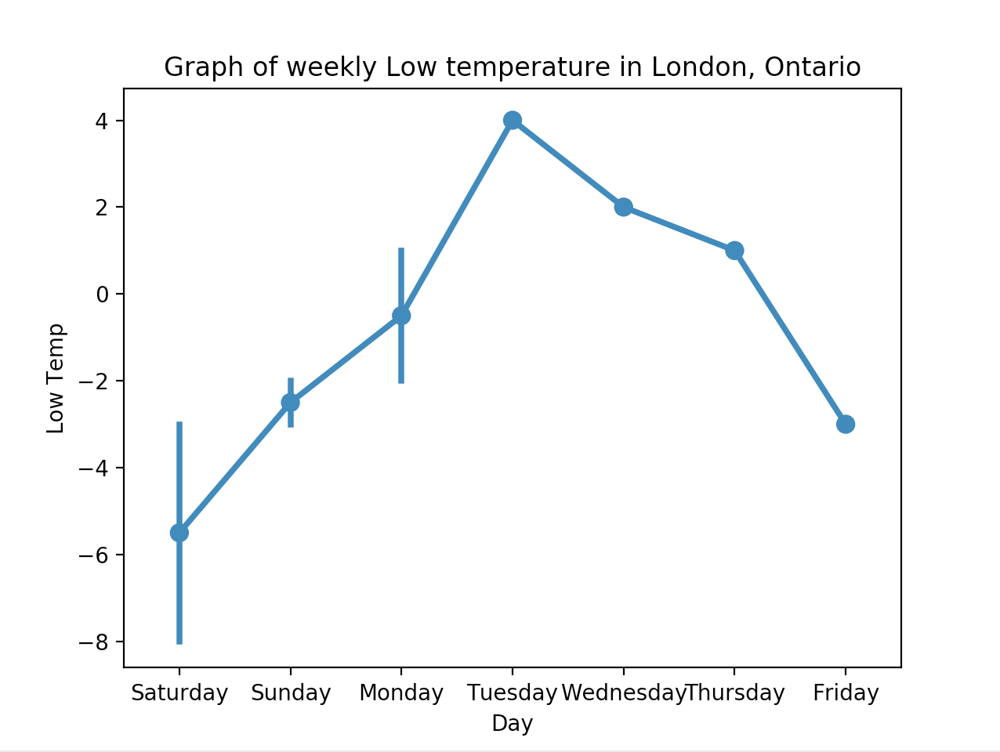

class: impact

# Intro to Python

## SheHacks II
Fatima | @sugaroverflow

---
# Hi I'm Fatima

.col-8[

## Tech Lead | Digital Echidna
## BS Computer Science | NYU Engr

### @sugaroverflow
]
.col-4[
  .rounded-border[]
]

---

# Python Essentials
## dynamic, interpreted language
  ### - no type declarations
## case sensitive
## object oriented

???
- There are no type declarations of variables, parameters, functions, or methods in source code.
- there is no compile-time type checking of the source code.
- Python tracks the types of all values at runtime and flags code that does not make sense as it runs.
  - runtime errors

---

# Syntax
```python

hackathon_name = 'SheHacks II'
print hackathon_name # SheHacks II

my_string = 'My favourite hackathon is '
my_string += hackathon_name
new_string = my_string + hackathon_name

# 'My favourite hackathon is SheHacks II'
```
---

# Strings
```python
print("Name: %s\
\nDate: %s\
\nWorkshop: %s" % ( 'Fatima', '3/25', 'Intro to Python'))

"""
Name: Fatima
Date: 3/25
Workshop: Intro to Python
"""
```

---
# Data Types

```python
# primitives
var_string = 5
var_int = 4.5
var_bool = True
```
--

```python
# lists
list_empty = []
list_one = [3.0]
list_num = [1, 2, 3, 4, 5]
list_str = ['hello', 'world']
list_misc = ['first', [], 'second', [1, 2, 3, 4], 'third']
print list_str[1] # world
```

---
# Data Types


```python
# tuples
var_tuple = (1, 2, 3, 4)
var_tuple[2] # 3
```
--

```python
# dictionaries
var_dictionary = {'A': 'apple', 'B': 'banana'}
print var_dictionary['A'] # apple
```
---
# Conditionals

```python
# if
my_name = 'Fatima'
if my_name == 'Fatima':
  return TRUE
```
--

```python
# for
num_list = [1, 2, 3, 4, 5, 6]
for num in num_list:
  if num % 2 == 0:
    print num
    # 2 4 6
```

---
# Conditionals

```python
# while
some_list = ['hello', 'world', 'bye']
counter = 0
while counter < len(some_list):
  print counter
  counter += 1
  if some_list[counter] == 'bye': print 'yes!'
  else: print 'nope!'
# nope! yes!
```

---
# Functions

```python

# function with parameter
def happyBirthday(person):
    """
    Returns a string using the name given.
    """
    return("Happy Birthday to " + person + "!")
```
--

```python

def main():
  print happyBirthday('Emily') # Happy Birthday to Emily!
```

???
- *def* keyword defines the function with its parameters within parentheses and its code indented.
- *Docstring*  describes what the function does.
- *Variables* defined in the function are *local* to that function
- *return* statement can take an argument, in which case that is the value returned to the caller.

At run time, functions must be defined by the execution of a "def" before they are called. It's typical to def a main() function towards the bottom of the file with the functions it calls above it.

---
# understanding an interpreted language
```python
def main():
    if name == 'Fatima':
        print haaaappyBirthday(name) + '!!!'
    else:
        print happyBirthday(name)
```

???
- This code compiles and runs fine so long as the name at runtime is not ‘Fatima’. Only when a run actually tries to execute the haaaappyBirthday() will it notice that there is no such function and raise an error.

---
# Workshop
## Getting data from the Wunderground API
  ### - using the  `urllib` library
## Visualizing that data with Seaborn
  ### - using `Seaborn` viz library based on `matplotlib`

---
# Wunderground API
### worldwide weather data, weather reports,
### maps & tropical weather conditions

## Register for API key
`wunderground.com/weather/api`
`aac66ae63af63f1d`

## API documentation
`wunderground.com/weather/api/d/docs`


---
# Getting started with Python

create a `weatherdata.py` file in your project:

```python
#!/usr/bin/env python

# import modules used here
import sys
```
--
```python
# Gather our code in a main() function
def main():
    print "Intro to Python Workshop"
```
--
```python
# call the main() function to begin
if __name__ == '__main__':
    main()
```
---

# urllib

## a Python module that can be used for fetching URLs.
##  functions and classes to help with URL actions
  ### - basic  authentication,
  ### - redirections,
  ### - cookies, etc

---
# Creating a function

```python
def get_weather_json(city):
    """
    Gets the 10 day forecast of a city in Canada.
    And writes it to a CSV file.
    """
    return "data"
```
--
```python
def main():
  get_weather_json('London')
```

???
- create a function to get the data
- call it from the main function.

---
# Getting the data

```python
def get_weather_json(city):

    response = urlopen('http://api.wunderground.com/api/'
     + WAPI_KEY
     + '/forecast10day/q/canada/'
     + city
     + '.json')

    data = json.load(response)
```

???

http://api.wunderground.com/api/aac66ae63af63f1d/forecast10day/q/canada/London.json

---

# Writing to a CSV

```python
  with open('%s.csv' % city, 'w') as outfile:
    writer = csv.writer(outfile)
    writer.writerow(["Day", "Low Temp"]) # header row

    for day in data['forecast']['simpleforecast']['forecastday']:
      row = []
      row.append(str(day['date']['weekday']))
      row.append(day['low']['celsius'])
      writer.writerow(row)
```

- `python weatherdata.py`

???
  - http://api.wunderground.com/api/aac66ae63af63f1d/forecast10day/q/canada/London.json
  - run the script and check the csv file.
  - now that we have some data, let’s visualize it!
----

# Matplotlib


???
For those who’ve tinkered with Matplotlib before, you may have wondered, “why does it take me 10 lines of code just to make a decent-looking histogram?”

---

# Pandas

`pandas.pydata.org`

## a data analysis library
## takes data and creates a DataFrame
### - a python object with rows and columns

???
Python Data Analysis Library
---

# Seaborn

`seaborn.pydata.org`

##  high-level interface to Matplotlib
## default themes, custom colour palettes
## visualizing information from matrices

???
- If matplotlib “tries to make easy things easy and hard things possible”, seaborn tries to make a well-defined set of hard things easy too.
- complement to matplotlib not substitute

---
# Plotting our temperature data

create a `plotweather.py`
```python

import pandas as pd
from matplotlib import pyplot as plt
import seaborn as sns
```
--
```python
def main():
  # do fancy things here.

if __name__ == '__main__':
    main()

```
---
# Plotting our temperature data

```python
  temps = pd.read_csv('London.csv') # read data with pandas
```

--

```python
  # plot with seaborn
  sns.pointplot(x = "Day", y = "Low Temp", data = temps)
```

--

```python
  plt.title("Graph of weekly Low temperature in London, Ontario")
  plt.xlabel("Day")
  plt.ylabel("Low Temp");
```
--

```python
  plt.show() # show the plot
```

---
# Our first plot!
.half.center[]

---
# Challenge!

## Plotting High & Low temperatures for London
## Median temps for Feb 2018
## Winter Snowfall
---

# Other cool libraries
## [NumPy](http://www.numpy.org/)
## [Beautiful Soup](https://www.crummy.com/software/BeautifulSoup/)
## [Scikit-Learn](http://scikit-learn.org/)

???
- NumPy is the fundamental package for scientific computing with Python. It contains among other things:
- Beautiful Soup is a Python library designed for quick turnaround projects like screen-scraping.
-  It provides a set of common machine learning algorithms to users through a consistent interface. Scikit-Learn helps to quickly implement popular algorithms on datasets.

---

# Resources and cool projects

##  [Analyze Taylor Lyrics using Python](https://github.com/irenetrampoline/taylor-swift-lyrics)
##  [Humble Intro to Analysis with Pandas and Seaborn | Kaggle](https://www.kaggle.com/crawford/humble-intro-to-analysis-with-pandas-and-seaborn)
## [Flask](http://flask.pocoo.org/)
## [Face Recognition](https://github.com/ageitgey/face_recognition)


